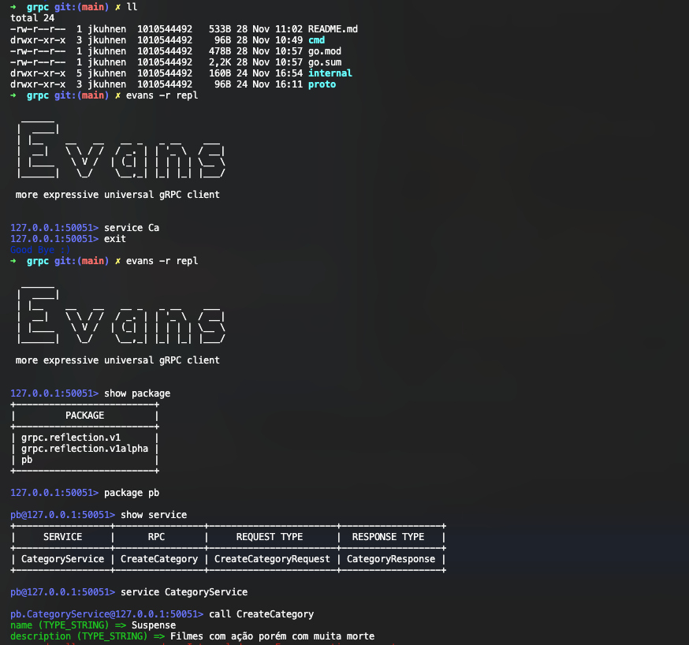

Files on directory `/internal/proto` are representative of the gRPC API contracts.

Files on directory `/internal/pb` are generated by the `protoc` command should not be changed.

#### Protoc command:

``protoc --go_out=. --go-grpc_out=. proto/course_category.proto``

#### Evans GRPC
Used to test the gRPC API.

https://github.com/ktr0731/evans

This command starts a terminal interactive with grpc api. 
To use it, you need to have the server running on port 50051.
If the port is different, you should specify using -p flag on the command.

``evans -r repl``

### First execution

### TODO
1 - Define a contract on proto file for the grpc api. Ex: course_category.proto
2 - Generate the pb files using the protoc command. Ex: ``protoc --go_out=. --go-grpc_out=. proto/course_category.proto``'
3 - Implement the grpc server. Ex: ``internal/grpc/course_category.go``